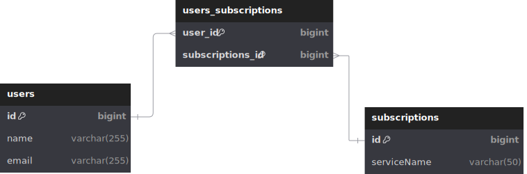

# REST API users_subscriptions

Микросервис для управления подписками пользователей с REST API.

###  Стек технологий:

#### Java 17,  Maven 3.8+, Spring Boot 3, JPA Hibernate, PostgreSQL, Slf4j, Docker.

### **Доступные эндпоинты**

#### Пользователи

    * POST /users - Создать пользователя
    * GET /users/{id} - Получить пользователя со списком его подписок
    * GET /users?ids=1,2 - Получить пользователей по ID, или всех пользователей если не указывать список ID
    * PUT /users/{id} - Обновить данные пользователя
    * DELETE /users/{id} - Удалить пользователя
    * PUT /users/{id}/subscriptions/{sub_id} - Добавить подписку пользователю
    * DELETE /users/{id}/subscriptions/{sub_id}  - Удалить подписку у пользователя

#### Подписки

    * POST /subscriptions - Создать подписку
    * DELETE /subscriptions - Удалить подписку
    * GET /top?count=5 - Получить ТОП-N популярных подписок, если не указать параметр, то ТОП-3
    * GET /subscriptions/users/{id} - Получить всех пользователей, у поторых есть подписка с указанным ID

### **Инструкция по сборке**:

1.Установить необходимые инструменты:

    - JDK 17+
    - Maven 3.8+
    - Docker 20.10+

2.Перейти в корневую директорию проекта.

3.Выполнить команду для сборки проекта:

    - mvn clean package

### **Инструкция по запуску через Docker**:

Выполнить команду:

    - docker compose up

### **ER диаграмма:**

